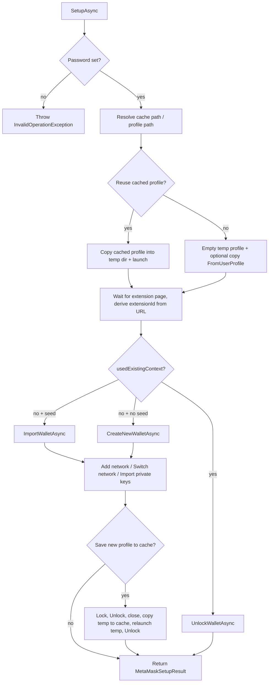

# MetamaskSetup.Playwright

Library for **end-to-end and integration tests** that need a real MetaMask wallet inside **Chromium**, driven by [Playwright for .NET](https://playwright.dev/dotnet/). It launches a **persistent browser profile** with the MetaMask extension loaded, then walks through onboarding and wallet management the same way a user would—so your DApp or web3 UI can be exercised against an actual extension, not mocks.

The public surface is centered on **`MetaMaskSetupService`** (fluent configuration). `SetupAsync` returns a **`MetaMaskSetupResult`** with Playwright’s **`IBrowserContext`** and the MetaMask **`ExtensionId`** for your application under test.

## Supported / not supported

| Supported (bootstrap) | Not supported (you implement) |
|------------------------|-------------------------------|
| Launch Chromium with MetaMask extension | DApp connect / `eth_requestAccounts` popups |
| Create wallet, import SRP, unlock/lock | Transaction confirm / reject UI |
| Add custom network, switch network | `personal_sign` / typed-data signing |
| Import accounts by private key, switch account | Token spend / permit / switch-chain prompts |
| On-disk profile cache for faster re-runs | Headless MetaMask |

This library is a **wallet bootstrap** helper, not a full Synpress-style Dapp confirmation framework. `MetaMaskSetupResult.ExtensionId` is exposed so you can automate notification pages yourself.

## What you can automate

| Area | Capabilities |
|------|----------------|
| **Browser** | Launch Chromium with MetaMask via `--load-extension` / persistent context (required for extensions; not headless). |
| **Wallet** | Create a new wallet, import from a seed phrase, unlock after restarts, lock/unlock when saving cached profiles. |
| **Networks** | Add a custom network (RPC, chain ID, symbol, optional block explorer) and switch networks (popular, additional, or custom lists). |
| **Accounts** | Import additional accounts from private keys; switch account by name or address (via the extension UI). |
| **Performance** | Optional **on-disk profile cache**: after a full setup, copy the user profile to a cache so the next run can reuse it and only unlock (faster CI runs when the scenario allows). |
| **Lifecycle** | `SetupAsync` returns `MetaMaskSetupResult`; `CleanupAsync` closes the context and removes temporary profiles. |

## Supported MetaMask version

This package supports **one** MetaMask extension build per release. All UI flows use **selectors** that match that build’s UI.

| Constant | Location | Value |
|----------|----------|--------|
| `METAMASK_VERSION` | `MetamaskSetup.Playwright.Meta.Constants` | **13.2.3** |

You must load an **unpacked** extension directory (folder containing `manifest.json`) that matches this version. `SetupAsync` reads `manifest.json` and **fails fast** if the version does not match. When MetaMask’s UI changes, a new **library release** will update selectors and the constant—consumers should not mix arbitrary extension versions with the package.

## Getting the MetaMask extension

This package does **not** download or bundle MetaMask. Install the correct Chrome build yourself (match the version above).

A practical option is **[MetaMask Download Manager](https://github.com/DApp-Automation-Tools/metamask-download-manager-net)** ([NuGet: `MetaMaskDownloadManager`](https://www.nuget.org/packages/MetaMaskDownloadManager/)), which can download MetaMask releases from GitHub (specific version or latest), list available versions, and optionally use a `GITHUB_TOKEN` to reduce API rate limits. See the project’s [README](https://github.com/DApp-Automation-Tools/metamask-download-manager-net/blob/main/README.md) for setup and examples.

After download, point the setup service at the **unpacked** extension folder (the directory that contains `manifest.json`).

## Requirements

- .NET 8 (`net8.0`)
- Unpacked MetaMask **matching** `Constants.METAMASK_VERSION`
- **Non-headless** Chromium (MetaMask does not run in headless mode; the service uses `Headless = false` for the persistent context)

## Install

```bash
dotnet add package MetamaskSetup.Playwright
```

## Architecture

| Layer | Responsibility |
|--------|----------------|
| **`MetaMaskSetupService`** | Fluent config, profile/cache resolution, launching persistent context, orchestrating onboarding vs unlock, optional cache write, `CleanupAsync`. |
| **`MetaMaskDriver`** | Facade over onboarding, home, and lock flows (`IMetaMaskDriver`). |
| **`OnboardingPageDriver`** | Get started, terms, create wallet vs import SRP, password step, skip backup / opt-out, pin extension, finalize popovers. |
| **`HomePageDriver`** | Networks (add custom, switch), accounts (import private key, switch by name/address), lock, dismiss popovers, read current network label. |
| **`LockPageDriver`** | Wait for lock screen, unlock with password. |
| **`WaitUtils` / `MetaMaskUtils`** | Load stability, polling, loading overlays, optional recovery from MetaMask error overlays. |

## High-level setup flow (`SetupAsync`)



### Password

`WithPassword` is **required**. The same password is used for onboarding (create/import) and for **unlock** when reusing a profile or cache.

### Three ways to get a ready wallet

1. **Fresh onboarding (no prior profile)**  
   Do **not** call `FromUserProfile`. Either omit `WithSeedPhrase` → **create new wallet**, or set `WithSeedPhrase` → **import wallet** (preferred when you need a deterministic funded account).

2. **Explicit existing profile**  
   `FromUserProfile(path)` copies that profile into a temp user-data directory, then launches. Only **`UnlockWalletAsync`** runs (no import/create, and **no** add network / switch network / private-key import from `SetupAsync`).

3. **On-disk cache (faster repeat runs)**  
   Default cache root: `./cache/metamask-profiles` unless you change it with `WithContextCachePath`. If the path passed to `WithContextCachePath` looks like a **Chromium profile** (it contains a `Default` subdirectory), it is treated as a **direct profile directory** for resolution, not only a cache folder. When cache reuse is enabled and a matching cache entry exists, that profile is reused → **unlock only** (same skipped steps as (2)).

### Create-new wallet and caching

Create-new generates a **random** wallet each run. Caching that path without a discriminator would reuse the wrong address. Rules:

- Call **`WithCacheDiscriminator("my-suite-id")`** when you want create-new profiles cached.
- If create-new runs **without** a discriminator, cache read/write is **disabled** (with a console warning), even when `UseContextCacheIfExists(true)`.

Import-by-SRP does not need a discriminator; the seed is part of the cache key.

### Steps that run only on a **new** context

When the service does **not** reuse an existing profile/cache (`usedExistingContext` is false), after create or import it runs **in order**:

1. **`AddNetworkAsync`** if `WithNetworkToAdd` was set  
2. **`SwitchNetworkAsync`** if `WithNetworkToSelect` was set  
3. **`ImportWalletFromPrivateKeyAsync`** for each key from `WithAdditionalAccounts`  
4. A delay from **`WithExtensionSaveDelayMs`** (default **2000 ms**) so the extension can persist state  

When reusing a profile or cache, **none** of the above run inside `SetupAsync`—the saved profile already defines networks and accounts. Changing fluent network/account options without invalidating the cache key will **not** update a cached profile; delete the cache entry or change parameters that affect the key.

### Cache key and cache write

- **Cache key**: first **16 hex characters** of **SHA256** over seed phrase (or the literal `new`), password, `Constants.METAMASK_VERSION`, optional network-to-add fields, **network-to-select**, concatenated private keys, and optional **cache discriminator**.
- **Populate cache**: After a full fresh setup, when caching is enabled and eligible, the service may **lock → unlock → close context → copy the temp profile to the cache path → relaunch from the temp profile → unlock** so the on-disk cache is written and the returned context remains usable.

### Cleanup

- **`CleanupAsync(IBrowserContext)`** / **`CleanupAsync(MetaMaskSetupResult)`** closes the context and deletes the **temporary** profile directory under `%TEMP%\playwright_metamask_<guid>` when applicable.  
- If `SetupAsync` throws, the service attempts to clean up the temp profile before rethrowing.

## UI flows (automation steps)

### Create new wallet

Get started → terms (checkbox, scroll, agree) → create new wallet → create using SRP → password (new, confirm, accept terms, submit with validation) → secure wallet later path, backup checkbox, skip backup, opt out → complete → download app continue → pin extension confirm → close popovers (new network info, generic popover, what’s new).

### Import wallet

Same get started and terms → import wallet → import using SRP → enter seed (`PressSequentiallyAsync`) and confirm (throws with MetaMask error text if invalid) → password step → opt out → complete → download app continue → pin extension **Next** then **Confirm** → finalize popovers → verify account address label starts with `0x` (throws on failure; rare MetaMask hang during onboarding).

### Unlock

Waits for the lock password field (timeout **15s**). If it never appears, the flow returns without unlocking (wallet already usable). If locked: fill password, submit, wait for spinner to disappear.

### Lock

Open account options → global **Lock** → wait for locked state.

### Add custom network

Network dropdown → custom networks tab → add network → fill name and RPC URL (with RPC URL error checks), add RPC row → chain ID and symbol → optional block explorer → save → close modal → wait until the current network label matches `NetworkConfig.Name` → close post-add popovers.

### Switch network

Tries **in order**: **Popular** tab by name; **Additional** networks (with optional “confirm adding network”); **Custom** tab by name. Throws if the network name is not found.

### Import account from private key

Account menu → add account or wallet → import with private key → fill key → confirm; surfaces MetaMask error text if import fails.

### Switch account

**By name** or **by address** via `IMetaMaskDriver` on `MetaMaskDriver`. These are **not** invoked by `MetaMaskSetupService.SetupAsync`; use `MetaMaskDriver` in your test if you need them.

### Current network name

`HomePageDriver.GetCurrentNetworkNameAsync` and `MetaMaskDriver.GetCurrentNetworkNameAsync` return the trimmed network label.

## `NetworkConfig`

| Property | Required | Purpose |
|----------|----------|---------|
| `Name` | yes | Display name; also used when waiting for the network after add. |
| `RpcUrl` | yes | Custom RPC endpoint. |
| `ChainId` | yes | Chain ID as MetaMask expects in the form. |
| `Symbol` | yes | Ticker symbol. |
| `BlockExplorerUrl` | optional | If set, drives the block explorer sub-flow. |

## Fluent API (`MetaMaskSetupService`)

| Method | Role |
|--------|------|
| Constructor `(IBrowserType browserType, string metamaskExtensionPath)` | Chromium type + unpacked extension path. |
| `FromUserProfile(string path)` | Copy and use an existing Chromium profile directory. |
| `WithPassword(string password)` | **Required.** Create/import/unlock. |
| `WithSeedPhrase(string phrase)` | On a new context: import; if omitted: create new wallet. |
| `WithNetworkToAdd(NetworkConfig)` | After fresh onboarding only. |
| `WithNetworkToSelect(string name)` | After fresh onboarding only; runs after add. |
| `WithAdditionalAccounts(params string[] privateKeys)` | After fresh onboarding only. |
| `WithContextCachePath(string path)` | Cache root or profile-shaped path (see setup flow). |
| `UseContextCacheIfExists(bool useCache = true)` | Toggle cache reuse / write behavior (default `true`). |
| `WithCacheDiscriminator(string)` | Required for caching create-new wallets; included in the cache key. |
| `WithExtensionSaveDelayMs(int ms)` | Quiet-window floor for extension write quiescence (default **2000**). Prefer leaving the default unless CI is slow. |
| `SetupAsync()` | Returns `MetaMaskSetupResult` (`Context` + `ExtensionId`) or throws. |
| `CleanupAsync(IBrowserContext)` / `CleanupAsync(MetaMaskSetupResult)` | Close context and remove temp profile. |

## Quick usage

```csharp
using MetamaskSetup.Playwright.Services;
using Microsoft.Playwright;

var playwright = await Playwright.CreateAsync();
var browserType = playwright.Chromium;

var setup = new MetaMaskSetupService(browserType, @"C:\path\to\unpacked-metamask-13.2.3")
    .WithPassword("your-secure-password");

var result = await setup.SetupAsync();
try
{
    var context = result.Context;
    // Use context.Pages / new pages for your app under test
    // result.ExtensionId is available if you automate MetaMask notification popups yourself
}
finally
{
    await setup.CleanupAsync(result);
}
```

## Example with network and accounts

```csharp
using MetamaskSetup.Playwright.Meta;
using MetamaskSetup.Playwright.Models;
using MetamaskSetup.Playwright.Services;
using Microsoft.Playwright;

var playwright = await Playwright.CreateAsync();
var chromium = playwright.Chromium;

var extensionPath = @"C:\path\to\metamask-chrome-13.2.3-unpacked";

var setup = new MetaMaskSetupService(chromium, extensionPath)
    .WithPassword("your-secure-password")
    .WithSeedPhrase("word1 word2 ... word12")
    .WithNetworkToAdd(new NetworkConfig
    {
        Name = "Localhost 8545",
        RpcUrl = "http://127.0.0.1:8545",
        ChainId = "31337",
        Symbol = "ETH"
    })
    .WithNetworkToSelect("Localhost 8545")
    .WithAdditionalAccounts("0x...private_key_hex...");

var result = await setup.SetupAsync();
try
{
    // Exercise your DApp; extension id is result.ExtensionId
}
finally
{
    await setup.CleanupAsync(result);
}
```

## Security and CI

- **Secrets**: Seed phrases and private keys live in configuration and in the **cache key input** (hashed on disk, but still sensitive in memory and in exception messages). Use throwaway test wallets; do not log credentials.  
- **Cache directories** under `./cache/metamask-profiles` (or your custom path) can hold wallet state—protect them like secrets.  
- **CI**: The workflow builds the solution and runs the full test suite under Xvfb (Chromium + MetaMask). Set `GITHUB_TOKEN` (provided automatically on GitHub Actions) so MetaMaskDownloadManager can fetch the pinned extension without rate limits. Optionally set `METAMASK_EXTENSION_PATH` to reuse a pre-cached unpacked build.

## Limitations

- **Single MetaMask UI version** per package release (`Constants.METAMASK_VERSION`); mismatched `manifest.json` fails fast.  
- **Not headless** by design.  
- **Reused or cached profiles**: `SetupAsync` does **not** re-apply `WithNetworkToAdd`, `WithNetworkToSelect`, or `WithAdditionalAccounts`; those apply only when onboarding into a **new** temp profile.  
- **Create-new without `WithCacheDiscriminator`**: caching is skipped to prevent wrong-wallet reuse.

## License

MIT (see package metadata).
